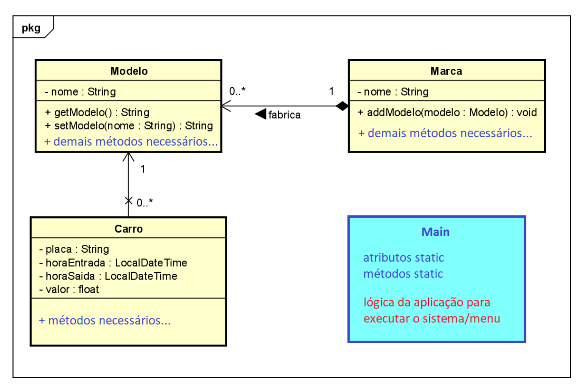

## Trabalho de estacionamento
---

## Contexto
---
O programa, desenvolvido individualmente ou em equipe (duplas ou trios), deve permitir a realização de operações de entrada e saída de carros de um estacionamento, bem como a consulta (através de relatório gerencial) da movimentação de um dia em particular. O projeto, cuja diagrama de classes inicial modelado no Astah UML e cujo esqueleto está disponível no arquivo Estacionamento.zip, já contém a base das classes Carro, Marca e Modelo (modelo de domínio da aplicação) e a classe de execução Principal. As classes devem ser completadas com os métodos necessários sem modificação dos atributos já existentes, bem como deve-se construir a classe Main, classe de execução, para atender ao menu principal e requisitos apresentados a seguir.

## Sessão Típica
---
Uma sessão típica consiste em:
1) __cadastrar a entrada do carro__ 
o sistema mostra uma lista de marcas para escolher uma (ArrayList marcas) e depois uma lista de modelos disponíveis para escolher daquela marca (a partir do ArrayList modelos da classe Marca). Caso o modelo não exista na lista, é possível escolher uma opção para cadastrar um novo modelo (o que pode incluir uma nova marca). Uma vez definido o modelo, pega-se a data e hora e inclui o carro no estacionamento (vetor vagas)
####
2) __efetuar uma saída de carro__
o usuário informa o número da vaga em uso (que corresponde a posição do vetor vagas), o sistema registra data e hora de saída lendo do sistema, calcula o preço e coloca este objeto Carro no ArrayList historico, deixando a vaga fica livre para ser usada novamente. A primeira hora custa RS 10.00 , que é o valor mínimo praticado. Após uma hora o valor é fracionado, R$ 2,00 a cada 15 minutos.
####
3) __cadastrar marca:__ 
permite o cadastro de novas marcas de carro (ou seja, novos objetos da classe Marca no ArrayList marcas definido como static na classe Principal).
####
4) __cadastrar modelo__ 
permite o cadastro de novos modelos de carros (fazer um add de um novo Modelo no ArrayList modelos da classe Marca) em uma marca já existente no sistema (ArrayList marcas)
####
5) __mostrar ocupação do estacionamento__ 
mostra a situação das 100 vagas, consultando o vetor vagas, mostra as vagas linearmente pelo número, com a informação de Livre ou de Ocupado (modelo placa - dd/mm/aaaa - hh:mm). Sendo o modelo, placa, data e hora de entrada os atributos do carro que está ocupando a respectiva vaga.
####
6) __mostrar relatório gerencial consolidado:__ 
solicita a data (dd/mm/aaaa) que se deseja consultar e mostra, consultando o ArrayList historico, todas as movimentações efetuadas naquele dia, cada linha do relatório contendo: placa, modelo, marca, entrada, saída e valor pago. Ao final, mostrar também o valor total faturado naquele dia.
## Requisitos
---
A organização do menu, linear como sugerido acima, ou em níveis, bem como a sequência/nomenclatura ficam livres para a equipe decidir, o importante é permitir que sejam possíveis as operações listadas, ou seja, a funcionalidade do sistema.
##
O vetor vagas, contendo as 100 vagas numeradas do estacionamento, e os ArrayList marcas e historico (todos static definido na classe Principal) devem ser usados na implementação de sua solução, bem como as três classes já estruturadas no código e no diagrama. Novos atributos podem ser adicionados bem como os diversos métodos de instância e de classe devem ser implementados para atender ao funcionamento esperado.
##
Ao estacionar um carro, a primeira vaga disponível no estacionamento (vetor vagas) deve ser utilizada (considerando que carros entram e saem, deixando vagas livres). O relatório gerencial deve ser mostrado em ordem de chegada (ascendente de horário), do início ao final do dia da data escolhida.
##
Para facilitar a apresentação prática do código funcionando, deixar alguns objetos cadastrados prontos nas listas, com criação dos objetos harcoded, logo no início da main. 
##
A tabela a seguir apresenta as características que serão avaliadas:

Reuso adequado dos métodos static na main (classe Principal)|
:-----------------------------------------------------------|
__Encapsulamento e métodos das classes Carro, Marca e Modelo__ |__empregados adequadamente, com sobrecarga e redefinição, conforme o caso__|
__Classe Carro (construção, métodos e uso)__|
__Classe Marca (construção, métodos e uso)__|
__Classe Modelo (construção, métodos e uso)__|
__Funcionalidade entrada__|
__Funcionalidade saída__|
__Funcionalidade cadastro de marca__|
__Funcionalidade cadastro de modelo__|
__Funcionalidade incluir modelo e/ou marca quando da entrada de um veículo__|
__Funcionalidade exibir ocupação do estacionamento__|
__Funcionalidade relatório gerencial consolidado a partir de data fornecida pelo usuário (ordenados por ordem de chegada)__|
__Emprego da estratégia de ordenação e interface adequada para o caso.__|
---

